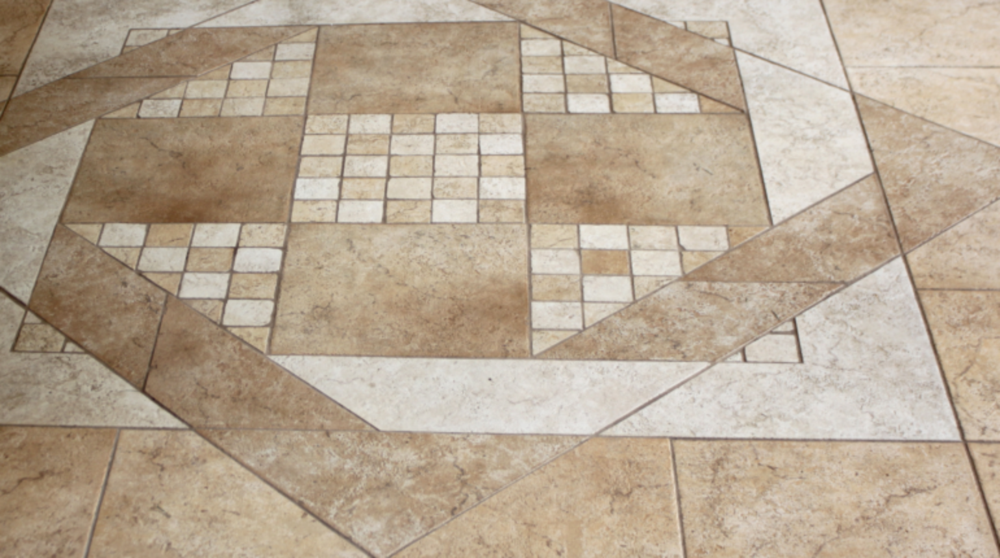

# NTU_3DCV-2022_HW1
> This is a homework for 3D Computer Vision with Deep Learning Applications.

The goal is to solve 2 problems:
1. Homography Estimation
    > Q: Given three color images A (1-0.png), B (1-1.png), and C (1-2.png), please follow the instruction to compute the homographies that warps the anchor image A to
    target image B and C.

    |A (1-0.png)|B (1-1.png)|C (1-2.png)|
    |--|--|--|
    ||||

    result: 
    
    more in [Report](Report.pdf)
2. Document Rectification
    > Rectification is one of the most fundamental techniques when digitizing documents.\
    > Q: Given an image of a document captured by the camera, please recover its original geometric
property which is lost after perspective transformation.

    captured image:\
    \
    result:\
    